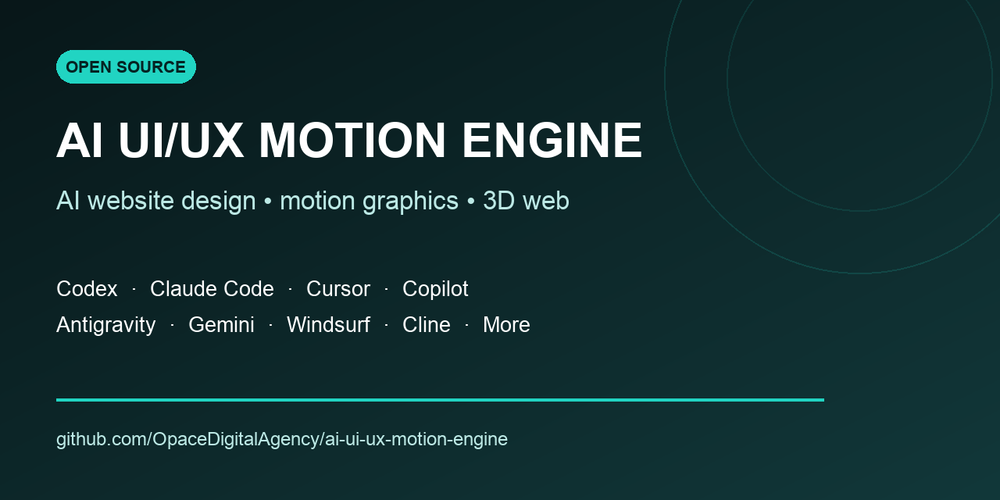

# AI UI/UX Motion Engine: Website Design Skill for Codex, Claude Code, Cursor, Copilot, Antigravity and Gemini

**Latest release: [v1.6.4](https://github.com/OpaceDigitalAgency/ai-ui-ux-motion-engine/releases/tag/v1.6.4)**

**AI UI/UX Motion Engine** is an open Agent Skill and plugin from
[Opace Digital Agency](https://opace.agency/services/web-design/) for AI
website design, UI design, UX design, frontend development, motion graphics,
creative coding, interactive websites and 3D web experiences. It works with
OpenAI Codex, Claude Code, Cursor AI, GitHub Copilot, Visual Studio Code agent
mode, Google Antigravity, Gemini CLI, Windsurf Cascade, Cline, Roo Code,
OpenCode, Amp, Zed, goose and other Agent Skills-compatible coding agents.



[Install the AI website-design skill](#installation) ·
[Read the Agent Skill](skills/ai-ui-ux-motion-engine/SKILL.md) ·
[Download the latest release](https://github.com/OpaceDigitalAgency/ai-ui-ux-motion-engine/releases/latest) ·
[Browse all Opace Agent Skills](https://github.com/OpaceDigitalAgency/skills)

## AI website design, UI/UX and motion graphics skill

**AI UI/UX Motion Engine** is an open, reusable Agent Skill for AI website
design, UI design, UX design, frontend development, motion graphics and
interactive web experiences. It gives OpenAI Codex, Claude Code, Cursor,
GitHub Copilot, Visual Studio Code agent mode, Google Antigravity, Gemini CLI,
Windsurf Cascade, Cline, Roo Code, OpenCode, Amp, Zed and compatible AI coding
agents a rigorous workflow for designing, redesigning, auditing and validating
production websites.

It is maintained by the team behind Opace’s
[web design and development services](https://opace.agency/services/web-design/),
combining practical frontend delivery experience with open, portable agent
workflows.

This repository is simultaneously a **Codex skill**, **Claude Code skill**,
**Cursor skill**, **Antigravity skill**, **Gemini CLI skill**, **GitHub Copilot
skill**, **VS Code Agent Skill**, **Windsurf skill**, **Cline skill**, **Roo Code
skill**, **OpenCode skill**, **Amp skill** and **Zed skill**. It also includes a
Codex plugin manifest, a Claude plugin manifest, cross-platform installers,
reference documentation, validation scripts and GitHub publishing guidance.

Use it to turn screenshots, screen recordings, videos, competitor research or
a product brief into an original visual system and a tested implementation. It
covers responsive web design, landing pages, SaaS websites, product pages,
portfolios, e-commerce experiences, dashboards, editorial storytelling,
interactive hero sections, 3D scroll effects, scroll-linked video, GSAP
ScrollTrigger, Framer Motion, Motion for React, Three.js, WebGL and accessible
micro-interactions—without forcing every project into the same template.

For cinematic scroll reveals, product-opening or assembly films, burst and
exploded-view effects, the skill now recognises the intended experience before
coding. It confirms accuracy, source media, provider access and spend; proves
one private signature sequence; rejects hallucinated geometry; then prepares
the approved media for smooth scroll delivery. Users do not need to know the
tool name or ask for “wow”.

Version 1.6.4 fails closed on scroll delivery: it proves every shipping video
frame is independently seekable, rejects P/B-frame derivatives, verifies
silence and fast-start, requires a poster generated from and visually matched
to the exact first decoded frame, serializes seeks, keeps the last decoded
frame visible and requires full-speed forward, reverse and direction-change
testing. Its accuracy-first lean profile uses explicit timeboxes, safe
parallelism and selective dense inspection instead of routine exhaustive frame
review. Normal playback and settled screenshots are not accepted as
scroll-scrub evidence.

> The skill extracts principles, structure and interaction intent. It does not
> clone protected branding, copy, source code or assets.

This is the dedicated human-facing, installation and release repository for
the `ai-ui-ux-motion-engine` skill. The
[Opace Agent Skills collection](https://github.com/OpaceDigitalAgency/skills)
is the umbrella catalogue for this and future technical SEO, on-page SEO,
content, accessibility and digital-marketing skills.

## Why this AI website-design skill exists

AI site builders and coding assistants can produce a technically valid first
pass that still feels generic: predictable card grids, default gradients,
weak typography, decorative animation and no evidence that keyboard, mobile or
reduced-motion users were considered.

AI UI/UX Motion Engine replaces one-shot prompting with a production workflow:

1. detect whether the reference depends on cinematic source motion;
2. confirm accuracy, sources, provider capability and spend before coding;
3. prove one private signature sequence when cinematic media is required;
4. establish the wider brief, source of truth and test baseline;
5. extract layout, design-system and motion principles from evidence;
6. commit to one concrete visual direction;
7. implement approved media and macro design before micro-polish;
8. validate identity, scrolling, accessibility, responsiveness and regressions.

The result is a repeatable AI frontend-design method rather than a collection
of fashionable effects.

## What it can build, redesign and audit

### Website and product use cases

- AI-generated landing pages and conversion-focused marketing sites
- SaaS product websites, startup homepages and software launch pages
- e-commerce storefronts, product-detail pages and interactive catalogues
- creative portfolios, agency sites, personal websites and case studies
- corporate, B2B, technology, fintech, healthcare and professional-services sites
- editorial layouts, long-form storytelling and immersive brand experiences
- web application dashboards, onboarding flows and product UI
- responsive website redesigns and design-system migrations
- screenshot-to-website, video-to-website and reference-led UI recreation
- visual QA, UX review, motion audit and anti-generic “AI slop” refinement

### UI/UX and design-system capabilities

- information architecture, section sequencing and conversion hierarchy
- responsive grids, spacing systems, typography scales and colour roles
- art direction, image treatment, surface design and component language
- hero design, navigation, calls to action, forms, FAQs and card systems
- loading, empty, error, success, hover, active and focus-visible states
- design-token extraction from multiple references without copying identity
- three fixed hero directions for controlled comparison when a real decision exists
- seven-level maturity thinking and a multi-pass refinement workflow

### Motion graphics and interactive web design

- prompt-to-video and reference-image-to-video product films without mandatory
  CAD, GLB or WebGL assets
- watch-style, scroll-linked product inspection with exact end-frame clip
  chaining and high-resolution video or canvas delivery
- CSS transitions, keyframes and progressive entrance effects
- Intersection Observer reveals and native scroll-driven animations
- GSAP timelines, ScrollTrigger pinning and horizontal scroll storytelling
- Framer Motion / Motion for React gestures, layout transitions and orchestration
- scroll-linked video scrubbing and canvas image-sequence animation
- Three.js, WebGL, React Three Fiber, Spline and real-time 3D product scenes
- sticky parallax sections and pinned narrative tracks
- word-by-word karaoke text reveals and kinetic typography
- infinite drag card stacks with keyboard and touch alternatives
- magnetic buttons, cursor-follow effects, hover depth and micro-interactions
- static and `prefers-reduced-motion` equivalents for every essential experience

## Supported AI coding agents, IDEs and providers

One canonical skill lives in
`skills/ai-ui-ux-motion-engine/`. The installers copy the complete folder to
the client’s documented discovery path, so provider-specific copies cannot
silently diverge.

| AI agent, editor or CLI | Project path | Personal/global path | Package status |
| --- | --- | --- | --- |
| OpenAI Codex app and Codex CLI | `.agents/skills/` | `~/.agents/skills/` | Native Codex plugin + Agent Skill |
| Anthropic Claude Code | `.claude/skills/` | `~/.claude/skills/` | Native Claude plugin + Agent Skill |
| Cursor AI | `.cursor/skills/` | `~/.cursor/skills/` | Native Agent Skill |
| GitHub Copilot and VS Code agent mode | `.github/skills/` | `~/.copilot/skills/` | Native Agent Skill |
| Google Antigravity IDE | `.agents/skills/` | `~/.gemini/config/skills/` | Native Agent Skill |
| Google Antigravity CLI | `.agents/skills/` | `~/.gemini/antigravity-cli/skills/` | Native Agent Skill |
| Google Gemini CLI | `.agents/skills/` | Project install used | Native Agent Skill |
| Windsurf / Cascade | `.windsurf/skills/` | `~/.codeium/windsurf/skills/` | Native Agent Skill |
| Cline for VS Code | `.cline/skills/` | `~/.cline/skills/` | Native Agent Skill |
| Roo Code for VS Code | `.roo/skills/` | `~/.roo/skills/` | Native Agent Skill |
| OpenCode | `.opencode/skills/` | `~/.config/opencode/skills/` | Native Agent Skill |
| Amp Code | `.agents/skills/` | `~/.config/agents/skills/` | Native Agent Skill |
| Zed Agent | `.agents/skills/` | `~/.agents/skills/` | Native Agent Skill |
| goose and other compatible agents | `.agents/skills/` | `~/.agents/skills/` | Open Agent Skills format |

See the [complete platform guide](platforms/README.md), the
[machine-readable compatibility matrix](platforms/platforms.json) and the
provider-specific guides:

- [OpenAI Codex, ChatGPT and Claude Code](platforms/openai-anthropic.md)
- [Cursor, Copilot, VS Code, Windsurf, Cline, Roo Code and OpenCode](platforms/editors-and-agents.md)
- [Antigravity, Gemini CLI, Amp, Zed, goose and the open standard](platforms/google-and-open-standard.md)

### What “ChatGPT compatible” means

ChatGPT is a user-facing product rather than a local skill directory. Use the
skill through Codex in ChatGPT/Codex environments or through a ChatGPT
workspace feature that explicitly accepts these instructions. This project
does not invent a fake `~/.chatgpt/skills` path.

OpenAI, Anthropic, Google Gemini, Azure OpenAI, Amazon Bedrock, Google Vertex
AI, OpenRouter, Ollama and other local or hosted model providers can power
different coding clients. Install the skill for the **client or agent**, not
for the model API.

## Frameworks, libraries and technology stacks

The workflow preserves the project’s current framework and package manager. It
contains recipes or decision guidance for:

| Area | Supported examples |
| --- | --- |
| Web frameworks | Astro, React, Next.js, Vue, Nuxt, Svelte, SvelteKit, static HTML/CSS/JavaScript |
| Styling and components | CSS, Sass, Tailwind CSS, CSS Modules, shadcn/ui, Radix UI, Magic UI, 21st.dev |
| Motion | CSS animation, Web Animations API, Intersection Observer, ScrollTimeline, Framer Motion, Motion for React, GSAP, ScrollTrigger |
| 3D and creative development | Three.js, React Three Fiber, WebGL, canvas, Spline, Unicorn Studio |
| Media | HTML video, image sequences, responsive images, `ffmpeg`, `ffprobe`, generated image/video assets |
| Validation | browser testing, Playwright-compatible workflows, accessibility checks, responsive screenshots, build/test/lint baselines |

Libraries are selected only when they solve a real interaction requirement.
The skill will not migrate a static site to React, add GSAP to a simple hover
effect or introduce WebGL solely to appear “premium”.

## Installation

Clone or download this dedicated repository:

```bash
git clone https://github.com/OpaceDigitalAgency/ai-ui-ux-motion-engine.git
cd ai-ui-ux-motion-engine
```

The repository contains the canonical skill folder plus macOS/Linux and
Windows installers supporting project and personal/global scope.

### macOS and Linux

```bash
./scripts/install-skill.sh --target codex --scope global
./scripts/install-skill.sh --target claude --scope global
./scripts/install-skill.sh --target cursor --scope global
./scripts/install-skill.sh --target copilot --scope global
./scripts/install-skill.sh --target antigravity --scope global
./scripts/install-skill.sh --target windsurf --scope global
```

Install into the current repository:

```bash
./scripts/install-skill.sh --target gemini --scope project
./scripts/install-skill.sh --target cline --scope project
./scripts/install-skill.sh --target roo --scope project
./scripts/install-skill.sh --target opencode --scope project
```

All accepted target names:

```text
codex claude cursor antigravity antigravity-cli gemini copilot vscode
cline roo opencode windsurf amp zed goose agents
```

Use `--project-dir /path/to/project` for another repository,
`--destination /path/to/skills` for a custom client and `--force` to replace
an existing copy of this exact skill.

### Windows PowerShell

```powershell
.\scripts\install-skill.ps1 -Target codex -Scope global
.\scripts\install-skill.ps1 -Target copilot -Scope project
.\scripts\install-skill.ps1 -Target windsurf -Scope global
```

Use `-ProjectDir C:\path\to\project`, `-Destination C:\path\to\skills` or
`-Force` when required.

### Manual portable installation

Copy the entire canonical folder—not only `SKILL.md`—into a supported skills
directory:

```bash
mkdir -p .agents/skills
cp -R skills/ai-ui-ux-motion-engine .agents/skills/
```

Keeping `SKILL.md`, `references/`, `scripts/` and `agents/` together preserves
progressive disclosure, implementation recipes and validators.

## How to use the skill

Agents can select it automatically when the request matches its description.
Where explicit invocation is supported, use:

```text
Use $ai-ui-ux-motion-engine to redesign this website.
```

### Prompt: build an original site from references

```text
Use $ai-ui-ux-motion-engine.

Goal: redesign this Astro product site for infrastructure buyers.
Evidence: the attached homepage screenshot and 40-second interaction recording.
Keep: the current content model, routes, photography and brand colours.
Extract: section rhythm from the screenshot and motion principles from the video.
Do not copy: names, copy, logos, source code or distinctive brand assets.
Validate: keyboard, touch, reduced motion, mobile, desktop, console and build.
```

### Prompt: improve an existing React or Next.js landing page

```text
Use $ai-ui-ux-motion-engine to audit and improve this Next.js landing page.
Preserve the stack and content. Identify generic AI-design patterns, weak
hierarchy, accessibility failures, motion without purpose and Core Web Vitals
risk. Implement one bounded section at a time and run the full regression
baseline before reporting completion.
```

### Prompt: cinematic 3D scroll and video storytelling

```text
Use $ai-ui-ux-motion-engine to create an impressive cinematic,
scroll-controlled product story from these references. Infer the required
media route, confirm accuracy, provider access and credits before coding, and
prove one private signature sequence before changing the page. Do not
substitute photo fades, CSS zooms or generic background video.
```

### Prompt: watch-style generated product inspection

```text
Use $ai-ui-ux-motion-engine to create a watch-style product experience from
approved reference images and prompts, without requiring CAD or a GLB model.
Classify it as illustrative, identity-locked or evidence-accurate; confirm the
provider and attempt budget; validate a cinematic brief; and prove one private
film before integration. Reject geometry/count drift and prepare accepted media
as an all-intra video plus exact frame sequence with static fallbacks.
```

### Prompt: UI/UX and motion audit only

```text
Use $ai-ui-ux-motion-engine in report-only mode. Do not edit files. Review the
site at mobile, tablet and desktop sizes for information hierarchy, responsive
layout, keyboard access, focus states, drag-only interactions, reduced motion,
animation performance and runtime errors. Separate observed facts from
recommendations.
```

More reusable requests are in
[references/prompts.md](skills/ai-ui-ux-motion-engine/references/prompts.md).

## The design and motion workflow

### 1. Brief and baseline

Define the audience, conversion goal, routes, content constraints, target
devices, framework, build commands and current test state.

### 2. Reference extraction

Map section order, proportions, typography roles, colour roles, imagery,
entrance behaviour, scrolling, hovering, dragging and state transitions.
Separate reusable principles from identity-specific material.

For a local video:

```bash
bash skills/ai-ui-ux-motion-engine/scripts/extract-reference-frames.sh \
  reference.mp4 ./reference-frames
```

### 3. Seven-line visual direction

Commit to product goal, audience, tone, composition, typography, colour/media,
motion and a signature differentiator. “Clean and modern” is not an
implementable direction.

### 4. Motion architecture

Choose CSS first for local states, then Intersection Observer or native scroll
animation, an existing framework library, GSAP for coordinated timelines,
video/canvas for photographic sequences, or WebGL only when depth materially
improves the story.

For an authored product-camera journey, the skill now runs a mandatory
cinematic intake before page implementation. It routes to generated
image-to-video, prompt-to-video, controlled 3D/CAD, compositing or footage
according to the required truth level. Real-time WebGL remains the route for
freely manipulable objects.

### 5. Multi-pass implementation

Build architecture and semantic content first; then macro layout, motion,
micro-states, responsive composition and editorial polish. Each component is
tested before the full regression baseline.

## Accessibility, performance and SEO quality gates

The skill requires:

- semantic HTML, logical reading order and keyboard-operable interactions;
- visible focus, useful labels and non-drag alternatives;
- a meaningful `prefers-reduced-motion: reduce` experience;
- primary content that is not dependent on animation or JavaScript;
- responsive validation at representative mobile, tablet and desktop sizes;
- no new console errors, hydration failures or broken routes;
- deliberate image/video loading and restrained main-thread animation work;
- honest Core Web Vitals and performance claims backed by measurements;
- descriptive page titles, headings, copy and metadata in the site being built;
- narrow component checks followed by the project’s full build/test baseline.

The workflow supports accessible web design and WCAG-oriented implementation,
but it never claims WCAG conformance from a checklist alone.

## Optional research, MCP and media tools

The core skill has no paid dependency. Optional tools are used only when the
task justifies them and the user authorises configuration or spend:

- browser automation for live visual, responsive and interaction testing;
- Firecrawl MCP for structured competitor research or site extraction;
- image-generation and video-generation tools for original media;
- Higgsfield or another current media provider when explicitly selected;
- `ffmpeg` and `ffprobe` for local video analysis and frame extraction;
- Awwwards, Godly, Land-book and other galleries as inspiration sources, never
  as permission to clone.

When a requested experience depends on photographic camera or object-state
change, a suitable media provider/source is a real production dependency. The
skill says so immediately and will not present a CSS substitute as equivalent.

Read
[tool-connections.md](skills/ai-ui-ux-motion-engine/references/tool-connections.md)
before configuring external services. Never commit credentials or assume paid
API access.

## Repository architecture

```text
.
├── .codex-plugin/plugin.json          # Codex plugin manifest
├── .claude-plugin/plugin.json         # Claude plugin manifest
├── .github/workflows/validate.yml     # GitHub Actions validation
├── platforms/
│   ├── platforms.json                 # verified target/path registry
│   ├── README.md                      # all-platform installation guide
│   └── *.md                           # provider-specific guides
├── scripts/
│   ├── install-skill.sh               # macOS/Linux installer
│   └── install-skill.ps1              # Windows installer
├── skills/ai-ui-ux-motion-engine/
│   ├── SKILL.md                       # canonical Agent Skill
│   ├── agents/openai.yaml             # Codex interface metadata
│   ├── assets/                         # cinematic brief and scroll controller
│   ├── references/                    # workflow and implementation guides
│   └── scripts/                       # prompts, media, safety and validators
├── GITHUB-PUBLISHING.md               # repo description, topics and release SEO
├── CHANGELOG.md
├── CONTRIBUTING.md
├── SECURITY.md
└── LICENSE
```

Detailed references include the complete workflow, motion patterns, framework
recipes, reference research, media pipeline, accessibility and performance,
tool connections, prompt library, source coverage and verification rules.

## Validation

Run package validation:

```bash
node skills/ai-ui-ux-motion-engine/scripts/validate-package.mjs
```

Validate a cinematic brief and render a repeatable provider prompt:

```bash
node skills/ai-ui-ux-motion-engine/scripts/validate-cinematic-brief.mjs \
  skills/ai-ui-ux-motion-engine/assets/cinematic-brief.example.json
node skills/ai-ui-ux-motion-engine/scripts/render-cinematic-prompt.mjs \
  skills/ai-ui-ux-motion-engine/assets/cinematic-brief.example.json \
  --mode flagship
```

Prepare an accepted film for exact scroll delivery:

```bash
bash skills/ai-ui-ux-motion-engine/scripts/prepare-scroll-media.sh \
  accepted-film.mp4 ./scroll-media
```

Audit a website repository for common unsafe motion patterns:

```bash
node skills/ai-ui-ux-motion-engine/scripts/audit-motion-safety.mjs \
  /path/to/website
```

The GitHub Actions workflow validates structure, documentation links, manifests,
platform targets, installer behaviour and motion-safety rules on every push and
pull request.

## GitHub and Google search discoverability

The root README intentionally uses precise terminology in meaningful sections
rather than relying on an unreadable keyword dump. Repository metadata is also
important. Before publishing, follow [GITHUB-PUBLISHING.md](GITHUB-PUBLISHING.md)
to set the repository description, 20 GitHub topics, release metadata and
social preview.

This dedicated repository is the human-facing, search-facing and sharing URL
for the skill. The portable agent implementation remains
[`SKILL.md`](skills/ai-ui-ux-motion-engine/SKILL.md), while the
[Opace Agent Skills collection](https://github.com/OpaceDigitalAgency/skills)
provides the wider catalogue.

Relevant discovery phrases covered naturally by this project include:

- AI website design skill, AI web design workflow, AI frontend design
- Codex skill, Codex plugin, OpenAI Codex website design
- Claude Code skill, Claude plugin, Anthropic frontend skill
- Cursor skill, Cursor AI web design, Cursor Agent Skills
- ChatGPT web design, ChatGPT coding and Codex website creation
- GitHub Copilot skill, Copilot coding agent, VS Code agent mode
- Google Antigravity skill, Antigravity CLI skill, Gemini CLI skill
- Windsurf skill, Cascade skill, Cline skill, Roo Code skill, OpenCode skill
- Amp skill, Zed Agent skill, goose skill, open Agent Skills
- UI design, UX design, UI/UX, product design, design engineering
- motion design, motion graphics, creative coding, interactive web design
- GSAP, ScrollTrigger, Framer Motion, Three.js, WebGL, React Three Fiber
- 3D website, scroll animation, parallax, video scrubber, kinetic typography
- Astro, React, Next.js, Vue, Nuxt, Svelte, SvelteKit, Tailwind CSS
- landing-page design, SaaS website, portfolio design, e-commerce UI
- accessibility, reduced motion, responsive design, Core Web Vitals
- prompt engineering, reference extraction, design-system extraction and MCP

No README can guarantee a Google or GitHub ranking. Clear naming, a useful
public repository, accurate topics, links, examples, releases and ongoing
maintenance are stronger discovery signals than repeating every possible
keyword.

## Frequently asked questions

### Is this a Codex skill or a Codex plugin?

Both. The portable Agent Skill can be installed directly under
`.agents/skills`, and `.codex-plugin/plugin.json` packages it for Codex plugin
distribution.

### Is this a Claude Code skill?

Yes. It includes a Claude plugin manifest and installs the canonical folder to
`.claude/skills` without converting it into an outdated `CLAUDE.md` prompt.

### Does it work with Cursor, GitHub Copilot and VS Code?

Yes. Each supports the `SKILL.md` folder format. The installer uses the native
Cursor or Copilot location and preserves all bundled references and scripts.

### Does it support Google Antigravity and Gemini CLI?

Yes. Antigravity IDE, Antigravity CLI and Gemini CLI have separate documented
paths, all covered by the installer and platform registry.

### Can it recreate a website from a screenshot or video?

It can extract layout, rhythm, design tokens and interaction principles, then
apply an original direction to the target project. It must not copy protected
identity, copy, source code or distinctive assets.

### Does it generate 3D animation and motion graphics?

It designs and implements web-based motion using CSS, Motion/Framer Motion,
GSAP, ScrollTrigger, video, canvas, Three.js and WebGL when appropriate. It can
also coordinate an authorised external image/video-generation workflow. For a
cinematic reveal, it first confirms provider access, truth mode, references,
cost and proof acceptance rather than attempting basic photo animation.

### Will it automatically install GSAP, Three.js or an MCP server?

No. It first reads the existing project and selects the smallest architecture
that satisfies the requirement. New dependencies, external services and paid
credits require justification and user authority.

### Does the skill guarantee accessibility, performance or SEO?

No. It supplies strong implementation and verification gates, but claims must
be based on direct tests and measurements in the actual project.

### Why is there one canonical skill folder?

Codex, Claude Code, Cursor, Copilot, Antigravity and the other listed clients
can consume the same portable folder. Duplicating its instructions into a
dozen provider directories would create stale and contradictory versions. The
manifests, installers and platform registry supply the provider-specific layer.

## Honest source coverage

The original Gemini output claimed complete transcription and implementation
of four source videos, but the saved source contains summaries rather than full
transcripts. This rebuild maps every recorded technique to a workflow,
reference or executable check and documents corrections in
[source-coverage.md](skills/ai-ui-ux-motion-engine/references/source-coverage.md).

## Contributing, security and licence

Read [CHANGELOG.md](CHANGELOG.md) for release history,
[CONTRIBUTING.md](CONTRIBUTING.md) before changing workflows or provider claims,
and [SECURITY.md](SECURITY.md) before reporting a vulnerability or handling
private references.

Maintained by [Opace Digital Agency](https://opace.agency/services/web-design/).
MIT licensed. See [LICENSE](LICENSE).
